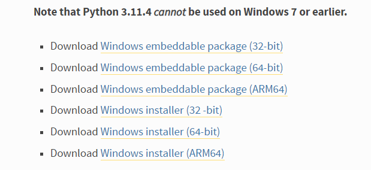

# 一、课程目标
1.配置frida环境，了解frida原理

2.从0到1编写frida脚本

3.了解frida的常用Api


# 二、工具

1.教程Demo(更新)

2.jadx-gui

3.雷电模拟器

4.VS Code

# 三、课程内容

## 1.什么是Frida？

Frida 是一款开源的动态插桩工具，可以插入一些代码到原生App的内存空间去动态地监视和修改其行为，支持Windows、Mac、Linux、Android或者iOS，从安卓层面来讲，可以实现`Java`层和`Native`层`Hook`操作。
[项目地址](https://github.com/frida/frida)
[官网及使用文档](https://frida.re/)
## 2.Frida原理及重要组件

frida注入的原理就是找到目标进程,使用ptrace跟踪目标进程获取mmap，dlpoen，dlsym等函数库的偏移获取mmap在目标进程申请一段内存空间将在目标进程中找到存放frida-agent-32/64.so的空间启动执行各种操作由agent去实现

|组件名称|功能描述|
|:---|:---|
|frida-gum|提供了inline-hook的核心实现，还包含了代码跟踪模块Stalker，用于内存访问监控的MemoryAccessMonitor，以及符号查找、栈回溯实现、内存扫描、动态代码生成和重定位等功能|
|frida-core|fridahook的核心，具有进程注入、进程间通信、会话管理、脚本生命周期管理等功能，屏蔽部分底层的实现细节并给最终用户提供开箱即用的操作接口。包含了frida-server、frida-gadget、frida-agent、frida-helper、frida-inject等关键模块和组件，以及之间的互相通信底座|
|frida-gadget|本身是一个动态库，可以通过重打包修改动态库的依赖或者修改smali代码去实现向三方应用注入gadget，从而实现Frida的持久化或免root|
|frida-server|本质上是一个二进制文件，类似于前面学习到的android_server，需要在目标设备上运行并转发端口，在Frida hook中起到关键作用|
## 3.Frida与Xposed的对比

| 工具 | 优点 | 缺点 |
| :--- | :--- | :--- |
| Xposed | 直接编写Java代码，Java层hook方便，可打包模块持久化hook | 环境配置繁琐，兼容性较差，难以Hook底层代码。 |
| Frida | 配置简单，免重启hook。支持Java层和Native层的hook操作 | 持久化hook相对麻烦 |

## 4.Frida环境配置

### 1.安装Python与VS Code
[下载python](https://www.python.org/downloads/windows/)



[下载VS Code](https://code.visualstudio.com/)

汉化:在插件搜索Chinese，选择第一个插件安装重启即可
### 2.虚拟环境的env的安装
1.  安装环境
```
pip install virtualenvwrapper-win -i https://pypi.tuna.tsinghua.edu.cn/simple
```
1. 设置WORKON_HOME环境变量
```
mkvirtualenv 新建环境
rmvirtualenv 删除环境
```
### 3.Frida安装以及多版本处理
```
pip install frida-tools -i https://pypi.tuna.tsinghua.edu.cn/simple
```
配置代码提示
### 4.push Frida-server
[点击下载](https://github.com/frida/frida)

PS:版本一定要对应！！！


## 5.Frida基础知识

### 1.基础指令
1.frida-ps -U  查看当前手机运行的进程
2.frida-ps --help 查看help指令
```
frida-ps --help
使用方式: frida-ps [选项]

选项:
  -h, --help            显示帮助信息并退出
  -D ID, --device ID    连接到具有给定ID的设备
  -U, --usb             连接到USB设备
  -R, --remote          连接到远程frida-server
  -H HOST, --host HOST  连接到HOST上的远程frida-server
  --certificate CERTIFICATE
                        与HOST进行TLS通信，期望的CERTIFICATE
  --origin ORIGIN       连接到设置了"Origin"头为ORIGIN的远程服务器
  --token TOKEN         使用TOKEN验证HOST
  --keepalive-interval INTERVAL
                        设置心跳包间隔(秒)，或设置为0以禁用(默认为-1，根据传输方式自动选择)
  --p2p                 与目标建立点对点连接
  --stun-server ADDRESS
                        设置与--p2p一起使用的STUN服务器地址
  --relay address,username,password,turn-{udp,tcp,tls}
                        添加与--p2p一起使用的中继
  -O FILE, --options-file FILE
                        包含额外命令行选项的文本文件
  --version             显示程序版本号并退出
  -a, --applications    只列出应用程序
  -i, --installed       包括所有已安装的应用程序
  -j, --json            以JSON格式输出结果
```

### 2.操作模式:
| 操作模式 | 描述 |  优点 | 主要用途 |
|---|---|---|---|
| CLI（命令行）模式 | 通过命令行直接将JavaScript脚本注入进程中，对进程进行操作 | 便于直接注入和操作 | 在较小规模的操作或者需求比较简单的场景中使用 |
| RPC模式 | 使用Python进行JavaScript脚本的注入工作，实际对进程进行操作的还是JavaScript脚本，可以通过RPC传输给Python脚本来进行复杂数据的处理 |  在对复杂数据的处理上可以通过RPC传输给Python脚本来进行，有利于减少被注入进程的性能损耗 | 在大规模调用中更加普遍，特别是对于复杂数据处理的需求 |

### 3.注入模式与启动命令:

| 注入模式 | 描述 | 命令或参数 | 优点 | 主要用途 |
|---|---|---|---|---|
| Spawn模式 | 将启动App的权利交由Frida来控制，即使目标App已经启动，在使用Frida注入程序时还是会重新启动App | 在CLI模式中，Frida通过加上 -f 参数指定包名以spawn模式操作App | 适合于需要在App启动时即进行注入的场景，可以在App启动时即捕获其行为 | 当需要监控App从启动开始的所有行为时使用 |
| Attach模式 | 在目标App已经启动的情况下，Frida通过ptrace注入程序从而执行Hook的操作 | 在CLI模式中，如果不添加 -f 参数，则默认会通过attach模式注入App | 适合于已经运行的App，不会重新启动App，对用户体验影响较小 | 在App已经启动，或者我们只关心特定时刻或特定功能的行为时使用 |
Spawn模式
```
frida -U -f 进程名 -l hook.js
```

attach模式 ：
```
frida -U 进程名 -l hook.js
```

frida_server自定义端口
```
frida server 默认端口：27042

taimen:/ $ su
taimen:/ # cd data/local/tmp/
taimen:/data/local/tmp # ./fs1280 -l 0.0.0.0:6666

```
`logcat |grep "D.zj2595"`日志捕获
`adb connect 127.0.0.1:62001`模拟器端口转发
### 4.基础语法

| API名称 | 描述 |
|---|---|
| `Java.use(className)` | 获取指定的Java类并使其在JavaScript代码中可用。|
| `Java.perform(callback)` | 确保回调函数在Java的主线程上执行。 |
| `Java.choose(className, callbacks)` | 枚举指定类的所有实例。 |
| `Java.cast(obj, cls)` | 将一个Java对象转换成另一个Java类的实例。 |
| `Java.enumerateLoadedClasses(callbacks)` | 枚举进程中已经加载的所有Java类。 |
| `Java.enumerateClassLoaders(callbacks)` | 枚举进程中存在的所有Java类加载器。 |
| `Java.enumerateMethods(targetClassMethod)` | 枚举指定类的所有方法。 |


### 5.日志输出语法区别

| 日志方法 | 描述 | 区别 |
|---|---|---|
| `console.log()` | 使用JavaScript直接进行日志打印 | 多用于在CLI模式中，`console.log()`直接输出到命令行界面，使用户可以实时查看。在RPC模式中，`console.log()`同样输出在命令行，但可能被Python脚本的输出内容掩盖。 |
| `send()` | Frida的专有方法，用于发送数据或日志到外部Python脚本 | 多用于RPC模式中，它允许JavaScript脚本发送数据到Python脚本，Python脚本可以进一步处理或记录这些数据。 |

### 6.Hook框架模板

```js
function main(){
    Java.perform(function(){
        hookTest1();
    });
}
setImmediate(main);
```

## 6.Frida常用API


### 1.Hook普通方法、打印参数和修改返回值

```js
//定义一个名为hookTest1的函数
function hookTest1(){
	//获取一个名为"类名"的Java类，并将其实例赋值给JavaScript变量utils
    var utils = Java.use("类名");
    //修改"类名"的"method"方法的实现。这个新的实现会接收两个参数（a和b）
    utils.method.implementation = function(a, b){
	    //将参数a和b的值改为123和456。
        a = 123;
        b = 456;
        //调用修改过的"method"方法，并将返回值存储在`retval`变量中
        var retval = this.method(a, b);
        //在控制台上打印参数a，b的值以及"method"方法的返回值
        console.log(a, b, retval);
        //返回"method"方法的返回值
        return retval;
    }
}

```


### 2.Hook重载参数

```js
// .overload()
// .overload('自定义参数')
// .overload('int')
function hookTest2(){
    var utils = Java.use("com.zj.wuaipojie.Demo");
    //overload定义重载函数，根据函数的参数类型填
    utils.Inner.overload('com.zj.wuaipojie.Demo$Animal','java.lang.String').implementation = function(a，b){
        b = "aaaaaaaaaa";
        this.Inner(a,b);
        console.log(b);
    }
}


```


### 3.Hook构造函数
```js
function hookTest3(){
    var utils = Java.use("com.zj.wuaipojie.Demo");
    //修改类的构造函数的实现，$init表示构造函数
    utils.$init.overload('java.lang.String').implementation = function(str){
        console.log(str);
        str = "52";
        this.$init(str);
    }
}


```


### 4.Hook字段
```js
function hookTest5(){
    Java.perform(function(){
        //静态字段的修改
        var utils = Java.use("com.zj.wuaipojie.Demo");
        //修改类的静态字段"flag"的值
        utils.staticField.value = "我是被修改的静态变量";
        console.log(utils.staticField.value);
        //非静态字段的修改
        //使用`Java.choose()`枚举类的所有实例
        Java.choose("com.zj.wuaipojie.Demo", {
            onMatch: function(obj){
	            //修改实例的非静态字段"_privateInt"的值为"123456"，并修改非静态字段"privateInt"的值为9999。
                obj._privateInt.value = "123456"; //字段名与函数名相同 前面加个下划线
                obj.privateInt.value = 9999;
            },
            onComplete: function(){

            }
        });
    });
    
}
```

### 5.Hook内部类
```js
function hookTest6(){
    Java.perform(function(){
        //内部类
        var innerClass = Java.use("com.zj.wuaipojie.Demo$innerClass");
        console.log(innerClass);
        innerClass.$init.implementation = function(){
            console.log("eeeeeeee");
        }

    });
}

```

### 6.枚举所有的类与类的所有方法
```js
function hookTest7(){
    Java.perform(function(){
        //枚举所有的类与类的所有方法,异步枚举
        Java.enumerateLoadedClasses({
            onMatch: function(name,handle){
	            //过滤类名
                if(name.indexOf("com.zj.wuaipojie.Demo") !=-1){
                    console.log(name);
                    var clazz =Java.use(name);
                    console.log(clazz);
                    var methods = clazz.class.getDeclaredMethods();
                    console.log(methods);
                }
            },
            onComplete: function(){}
        })
    })
}

```

### 7.枚举所有方法
```js
function hookTest8(){
    Java.perform(function(){
        var Demo = Java.use("com.zj.wuaipojie.Demo");
        //getDeclaredMethods枚举所有方法
        var methods =Demo.class.getDeclaredMethods();
        for(var j=0; j < methods.length; j++){
            var methodName = methods[j].getName();
            console.log(methodName);
            for(var k=0; k<Demo[methodName].overloads.length;k++){
                Demo[methodName].overloads[k].implementation = function(){
                    for(var i=0;i<arguments.length;i++){
                        console.log(arguments[i]);
                    }
                    return this[methodName].apply(this,arguments);
                }
            }
        }
    })
}

```

### 8.主动调用

静态方法
```js
var ClassName=Java.use("com.zj.wuaipojie.Demo"); 
ClassName.privateFunc();
```

非静态方法
```js
    var ret = null;
    Java.perform(function () {
        Java.choose("com.zj.wuaipojie.Demo",{    //要hook的类
            onMatch:function(instance){
                ret=instance.privateFunc("aaaaaaa"); //要hook的方法
            },
            onComplete:function(){
            	//console.log("result: " + ret);
            }
        });
    })
    //return ret;

```


# 六、视频及课件地址


[百度云](https://pan.baidu.com/s/1cFWTLn14jeWfpXxlx3syYw?pwd=nqu9)

[阿里云](https://www.aliyundrive.com/s/TJoKMK6du6x)

[哔哩哔哩](https://www.bilibili.com/video/BV1wT411N7sV/?spm_id_from=333.788&vd_source=6dde16dc6479f00694baaf73a2225452)

PS:解压密码都是52pj，阿里云由于不能分享压缩包，所以下载exe文件，双击自解压

# 七、其他章节
[《安卓逆向这档事》一、模拟器环境搭建](https://www.52pojie.cn/thread-1695141-1-1.html)  
[《安卓逆向这档事》二、初识APK文件结构、双开、汉化、基础修改](https://www.52pojie.cn/thread-1695796-1-1.html)  
[《安卓逆向这档事》三、初识smail，vip终结者](https://www.52pojie.cn/thread-1701353-1-1.html)  
[《安卓逆向这档事》四、恭喜你获得广告&弹窗静默卡](https://www.52pojie.cn/thread-1706691-1-1.html)  
[《安卓逆向这档事》五、1000-7=？&动态调试&Log插桩](https://www.52pojie.cn/thread-1714727-1-1.html)  
[《安卓逆向这档事》六、校验的N次方-签名校验对抗、PM代{过}{滤}理、IO重定向](https://www.52pojie.cn/thread-1731181-1-1.html)  
[《安卓逆向这档事》七、Sorry，会Hook真的可以为所欲为-Xposed快速上手(上)模块编写,常用Api](https://www.52pojie.cn/thread-1740944-1-1.html)  
[《安卓逆向这档事》八、Sorry，会Hook真的可以为所欲为-xposed快速上手(下)快速hook](https://www.52pojie.cn/thread-1748081-1-1.html)  
[《安卓逆向这档事》九、密码学基础、算法自吐、非标准加密对抗](https://www.52pojie.cn/thread-1762225-1-1.html)  
[《安卓逆向这档事》十、不是我说，有了IDA还要什么女朋友？](https://www.52pojie.cn/thread-1787667-1-1.html)  
[《安卓逆向这档事》十二、大佬帮我分析一下](https://www.52pojie.cn/thread-1809646-1-1.html)  
[《安卓逆向这档事》番外实战篇1-某电影视全家桶](https://www.52pojie.cn/thread-1814917-1-1.html)  
[《安卓逆向这档事》十三、是时候学习一下Frida一把梭了(上)](https://www.52pojie.cn/thread-1823118-1-1.html)  
[《安卓逆向这档事》十四、是时候学习一下Frida一把梭了(中)](https://www.52pojie.cn/thread-1838539-1-1.html)  
[《安卓逆向这档事》十五、是时候学习一下Frida一把梭了(下)](https://www.52pojie.cn/thread-1840174-1-1.html)  
[《安卓逆向这档事》十六、是时候学习一下Frida一把梭了(终)](https://www.52pojie.cn/thread-1859820-1-1.html)  
[《安卓逆向这档事》十七、你的RPCvs佬的RPC](https://www.52pojie.cn/thread-1892127-1-1.html#/)  
[《安卓逆向这档事》番外实战篇2-【2024春节】解题领红包活动，启动!](https://www.52pojie.cn/thread-1893708-1-1.html#/)  
[《安卓逆向这档事》十八、表哥，你也不想你的Frida被检测吧!(上)](https://www.52pojie.cn/thread-1921073-1-1.html)  
[《安卓逆向这档事》十九、表哥，你也不想你的Frida被检测吧!(下)](https://www.52pojie.cn/thread-1938862-1-1.html)  
[《安卓逆向这档事》二十、抓包学得好，牢饭吃得饱(上)](https://www.52pojie.cn/thread-1945285-1-1.html)  
[《安卓逆向这档事》番外实战篇3-拨云见日之浅谈Flutter逆向](https://www.52pojie.cn/thread-1951619-1-1.html)  
[《安卓逆向这档事》第二十一课、抓包学得好，牢饭吃得饱(中)](https://www.52pojie.cn/thread-1967845-1-1.html)
[《安卓逆向这档事》第二十二课、抓包学得好，牢饭吃得饱(下)](https://www.52pojie.cn/thread-1982444-1-1.html)
[《安卓逆向这档事》第二十三课、黑盒魔法之Unidbg ](https://www.52pojie.cn/thread-1995107-1-1.html)  
# 八、参考文档
[一篇文章带你领悟Frida的精髓(基于安卓8.1)](https://www.freebuf.com/articles/system/190565.html)  
[frida检测](https://www.52pojie.cn/forum.php?mod=viewthread&tid=1783400)  
[IDA&Frida 学习](https://www.52pojie.cn/forum.php?mod=viewthread&tid=1759879&highlight=frida)  
[Frida工作原理学习（1）](https://bbs.kanxue.com/thread-273450.htm)  
[frida源码阅读之frida-java](https://bbs.kanxue.com/thread-229215.htm)  
[Art 模式实现XposedNativeHook兼容Android10](https://bbs.kanxue.com/thread-251171.htm)  
[Frida 入门及介绍](https://blog.csdn.net/qq_1290259791/article/details/100381831)  
[https://bbs.kanxue.com/thread-278145.htm](https://bbs.kanxue.com/thread-278145.htm)  
[[原创]FRIDA 使用经验交流分享](https://bbs.kanxue.com/thread-265160.htm)
