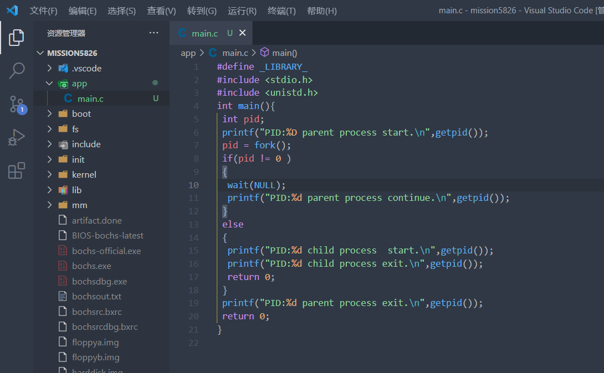
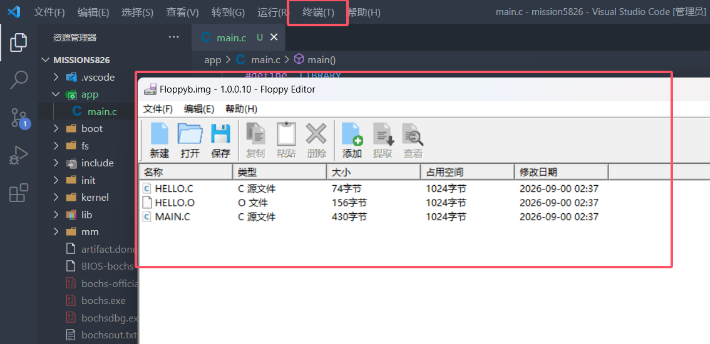
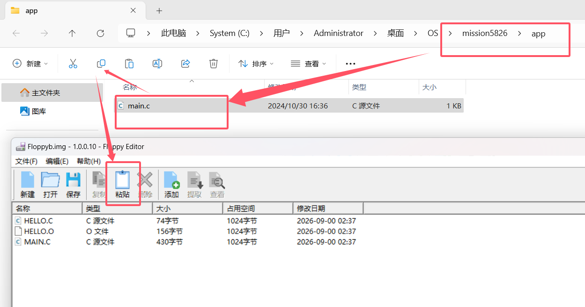
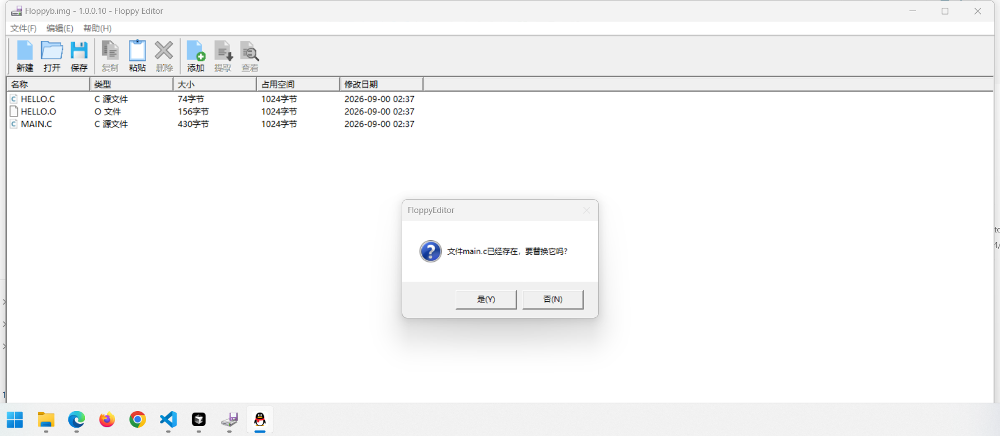
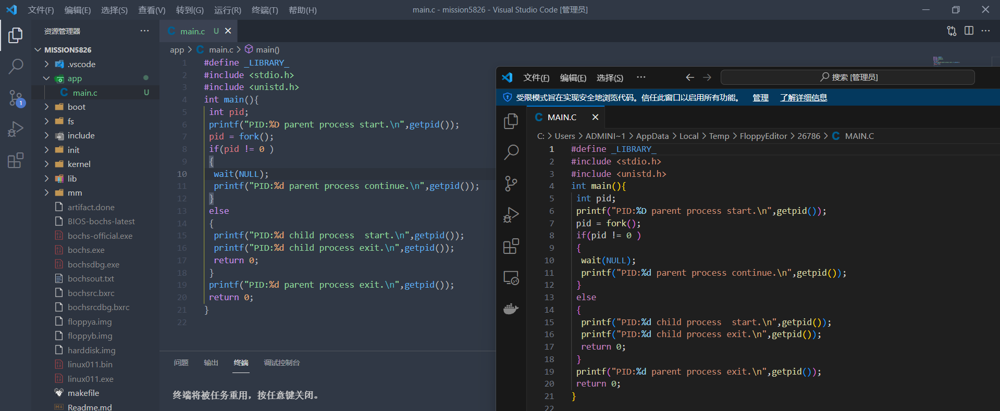
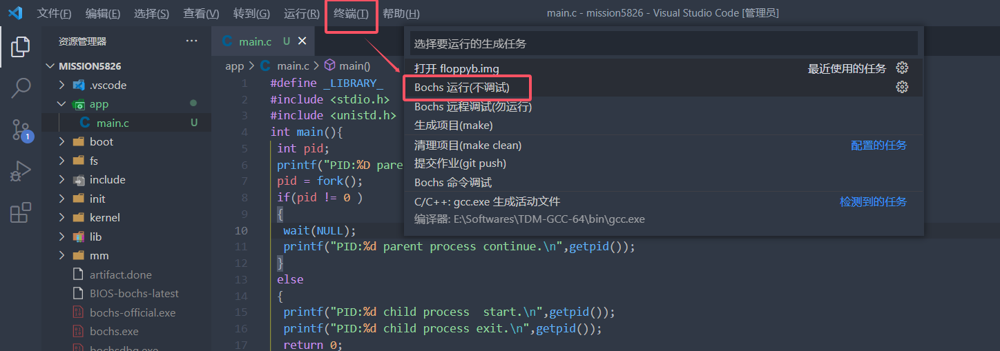
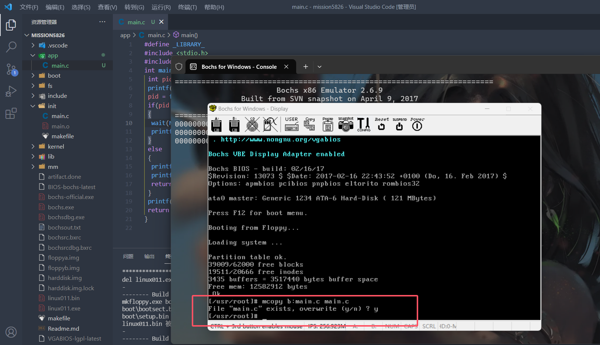
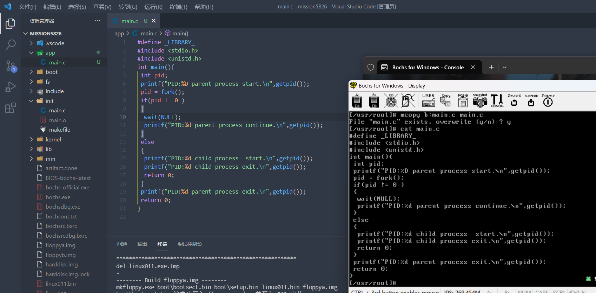

# 前言
在Linux011操作系统实验教程中让学生使用vi编辑器写代码和修改部分文件的操作，相信有些同学深受其害(vim大佬别来杠)，下面介绍一种可以在本地编写完所有的文件然后传入Linux011操作系统中方法

# 第一步，在本地编写好要导入的文件
下面我的为了方便演示，就将要导入的文件放在项目里面。

# 第二步，在"终端"-->"运行生成任务..."里选择"打开 floppyb.img"

# 第三步，将要导入的文件复制到floppyb.img文件中

如果显示已存在，当然要选择覆盖

可以在floppyb.img文件中双击我们要更改的文件，再次确认一下：（确定复制成功了）

# 第四步，在Bochs虚拟机中运行Linux
还是刚才的"终端"-->"运行生成任务..."里面

# 第五步，导入！
首先要切换到你要导入的linux系统中的路径，我这里直接在这儿导入了
然后执行一下命令：（mcopy b:<你保存到floppyb.img文件中的文件名(转化成小写)> <要保存成的文件名>）
命令中的b代表的是floppyb.img文件，如果已经存在记得覆盖（输入y即可）

可以验证得知，成功导入：

# 结语
这种方法我觉得仅适用于不想在这个老古董上面写东西的同学，但是vi和vim编辑器的使用方法还是需要掌握的。
（但是这样就能让AI检查你的代码了）（bushi）