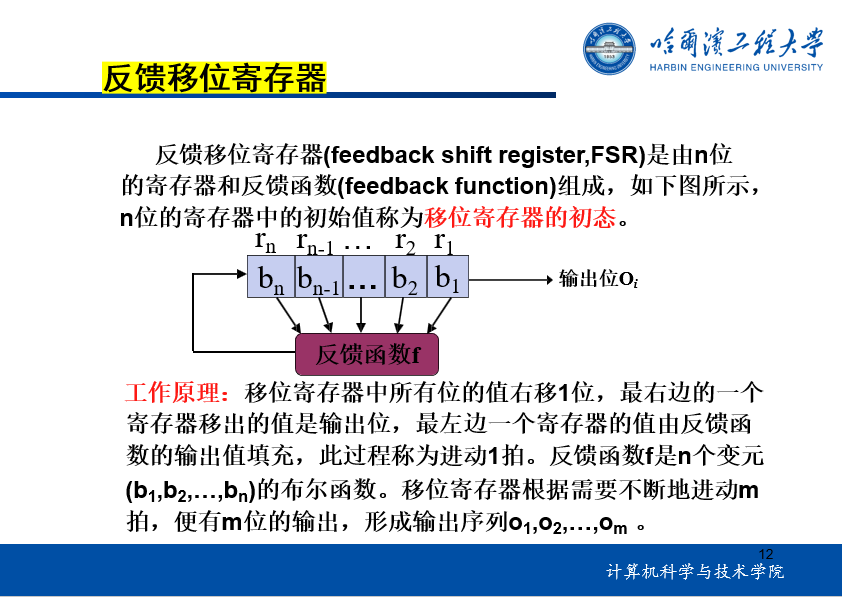
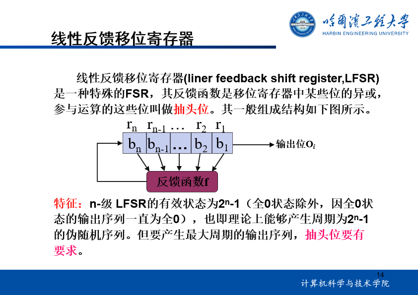
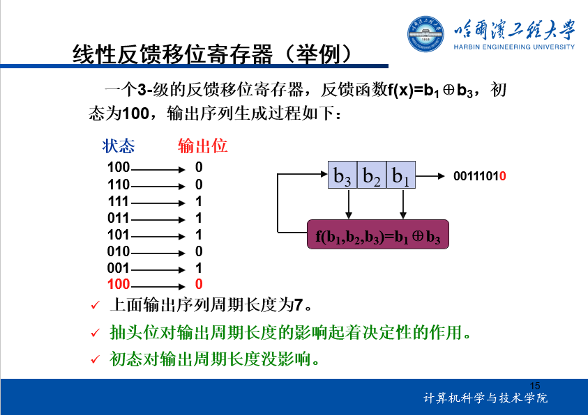

## 一、密码学概述

### 1.信息安全的六个属性

可用性、!!机密性!!、!!完整性!!、!!真实性!!、非否认性、可控性。

### 2.密码体制五元组(M, C, K, E, D)

- M: !!明文空间!!
- C: !!密文空间!!
- K: !!密钥空间（加密密钥、解密密钥）!!
- E: !!加密算法!!
- D: !!解密算法!!


### 3.安全模型

- !!唯密文攻击!!
- !!已知明文攻击!!
- !!选择明文攻击!!
- 自适应选择明文攻击
- !!选择密文攻击!!

### 4.密码体制

#### 柯克霍夫准则

密码体制的安全性完全寓于!!密钥!!之中。

## 二、古典密码学

### 1.置换密码
- 置换列密码
- 周期置换密码
### 2.代换密码
#### 单表代换密码
- 移位密码(凯撒密码)
- 仿射密码
- 替换密码
#### 多表代换密码
- 维吉尼亚密码
- Playfair密码
- 转轮密码
- 希尔密码
```mindmap
root((古典密码学))
    置换密码
        置换列密码
        周期置换密码
    代换密码
        单表代换密码
            移位密码(凯撒密码)
            仿射密码
            替换密码
        多表代换密码
            维吉尼亚密码
            Playfair密码
            转轮密码
            希尔密码
```
## 三、分组密码

设计思想：!!扩散!!、!!混淆!!

**操作模式：**

- !!电子密码本模式(ECB，Electronic Code Book)!!
- !!密码分组链接模式(CBC，Clipher Block  Chaining)!!
- !!密码反馈模式(CFB，Cipher Feedback)!!
- !!输出反馈模式(OFB，Output Feedback)!!

操作模式小结：
- ECB是最快、最简单的分组密码模式，但它的安全性最弱，一般不推荐使用ECB加密消息，但如果是加密随机数据，如 密钥，ECB则是最好的选择。
- CBC适合文件加密，而且有少量错误时不会造成同步失败，是软件加密的最好选择。
- CFB通常是加密字符序列所选择的模式，它也能容忍少量错误扩展，且具有同步恢复功能。
- OFB是在极易出错的环境中选用的模式，但需有高速同步机制。

### 1.DES密码算法

- 明文和密文为!!64位!!分组长度
- 密钥长度：!!56位!! , **但存在弱密钥，容易避开。**(!!64!!比特密钥中!!8!!比特为**校验位**)
- 采用**混乱**和**扩散**的组合，每个组合先!!替代!!后!!置换!!,共!!16!!轮

#### 密码模型
- Festel模型
#### 基本参数
- 分组长度：!!64比特!!
- 密钥长度：!!64比特!!
- 有效密钥长度：!!56比特!!
- 迭代圈数：!!16圈!!
- 每圈子密钥长度：!!48比特!!
#### 编码环节
- 6进4出的S盒变换
- 逐位模2加变换
- 比特移位变换P盒
- 比特移位变换E盒
- 比特抽取变换PC1、PC2和IP


### 2.AES密码算法
####  加密过程： **字节代换**、**行移位**、**列混淆**、**轮密钥加**
#### AES和DES不同之处
|               |            AES                   |              DES            | 
| :-----------: |         :-----------:            |         :-----------:       | 
|    密钥长度    | 128位、192位、256位(可变的)       |        56位(固定的)          | 
|    运算对象    |           面向字节                |           面向比特          | 
|   加解密运算   | 不一样，因而加密器不能同时用作解密器 |           无AES的限制       | 


### 3.SM4密码算法

#### 密码算法结构
```mermaid
flowchart TD
    A[128位密钥] --> B[密钥扩展]
    C[128位明文] --> D[基本轮函数]
    B --> D
    D --> E[128位密文]
    F{迭代控制} --> D
    D --> F
```

## 四、序列密码（流密码）
**算法举例： RC4、A5**
### 1.线性反馈移位寄存器




### 2.非线性序列
（选择填空）
- Geffe序列生成器
- J-K触发器
- Pless生成器
- 门限发生器

## 五、密码学数论基础

### 1.数论


#### **1.1欧拉定理**

- **欧拉函数**
设$m$是一个正整数，则$m$个整数$0,1,...,m-1$中与$m$互素的整数的个数，记为$\phi(m)$,称为欧拉函数。
**当$m$为素数时，$\phi(m)=m-1$**；**当$m$为[合数](https://baike.baidu.com/item/%E5%90%88%E6%95%B0/49186)时，$\phi(m)<m-1$。**

- **费马小定理**
设$m$是素数，$a$是任意整数，且$(a,m)=1$，则有$a^{m-1}\equiv 1(mod\ m)$。

- **欧拉定理**
设$m$是大于1的整数，$a$是与$m$互素的整数，则有$a^{\phi(m)}\equiv 1(mod\ m)$。

#### **1.2模重复平方计算法**


### 2.近世代数(抽象代数)
